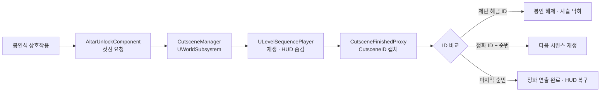

# Whisper of Forest

타락한 정령을 정화해 죽어가는 숲을 되살리는 **3인칭 액션 어드벤처**
Unreal Engine 5 · C++ / Blueprint · 6인 팀 프로젝트 · 2024.08 ~ 진행 중

---

## 게임 소개

성년을 맞이한 엘프 주인공이 타락한 숲의 정령들을 정화하며 숲이 죽어가는 원인을 추적하는 이야기입니다. 플레이어는 숲 곳곳에 봉인된 정령왕의 제단을 찾아 봉인을 해제하고, 타락한 정령왕과 전투한 뒤 정화합니다. 정령왕이 정화될 때마다 숲의 자연이 회복되며, 정화된 정령들과 상호작용할 수 있게 됩니다.

| | |
|---|---|
| **엔진** | Unreal Engine 5 (5.0.3) |
| **언어** | C++ / Blueprint |
| **플랫폼** | Windows PC |
| **팀** | 6인 (클라이언트 4 · 아트 2) |
| **담당** | 클라이언트 프로그래밍 · 레벨 디자인 / 렌더링 |

---

## 담당 범위

6인 팀 프로젝트 · **아래 항목만 본인 작업** 

| 영역 | 핵심 |
|---|---|
| [맵 렌더링 최적화](#1-맵-렌더링-최적화) | GPU 병목 추적 후 5개 기법 채택 · **최악 지점 19.97 → 5.25 ms** |
| [컷신 중앙 관리](#2-컷신-중앙-관리-시스템) | GameInstance 설계 폐기 → `UWorldSubsystem` 재설계 · ID 기반 종료 식별 |
| [제단 정화 시스템](#3-제단-정화-시스템) | 단일 클래스 → 기능별 컴포넌트 분리 · 봉인석 이벤트 기반 해금 |
| [세계수 패스트 트래블](#4-세계수-패스트-트래블) | 해금 목록 관리 · 텔레포트 재진입 차단 |
| [사슬 물리 연출](#5-사슬-물리-연출) | 병합 메시에서 체인 분리 후 Physics Constraint 적용 |
| 아트 리소스 | 머티리얼(Emissive Mask · Fresnel · 알베도) · VFX |

---

## 1. 맵 렌더링 최적화

최악 구간 **19.97 ms → 5.25 ms (−73.7%)** · FPS 아닌 **ms 단위 기록**

### 측정 조건

| | |
|---|---|
| 실행 | Standalone Game (에디터 PIE 아님) |
| 콘솔 | `r.VSync 0` · `t.MaxFPS 0` · `r.ScreenPercentage 100` · `stat none` |
| 계측 | CSV Profiler · 지점당 **40초 × 3세션** · 앞뒤 5초 트리밍 |
| 카메라 | 액터 + 레벨 블루프린트로 고정 → CSV `View/PosX·Y·Z` 전/후 **소수점까지 동일** |
| 표본 | 숲 6,598 / 13,001 프레임 · 화산 4,604 / 17,479 프레임 |

### 결과

| 지표 | 숲 전 → 후 | 화산 지대 전 → 후 |
|---|---|---|
| **평균 프레임타임** | 14.037 → **7.034 ms** (−49.9%) | 19.975 → **5.254 ms** (−73.7%) |
| 99퍼센타일 | 15.015 → 8.029 ms | 21.007 → 6.488 ms |
| 1% Low FPS | 66.6 → 124.6 | 47.6 → 154.1 |
| GPU Shadow Depths | 7.445 → 1.188 ms (−84.0%) | 10.766 → **0.482 ms (−95.5%)** |
| Primitives Drawn | 2.38M → 2.76M | 47.89M → **1.65M (−96.6%)** |
| 세션 간 평균 편차 | 0.129 ms | 0.014 ms |

**숲 Primitives 증가 건**

- 카운터는 증가, 프레임타임은 절반으로 감소
- VSM은 섀도 지오메트리를 컴퓨트 경로로 처리 → 해당 카운터에 미집계
- CSM 전환 시 일반 경로로 렌더 → 집계 시작
- 결론 : **Prims는 워크로드 지표가 아닌 렌더 경로 종속 카운터**

### 진단 → 방향 확정

| 단계 | 측정 | 판단 |
|---|---|---|
| 병목 판정 | `stat unit` — GPU 19.13 ms ≈ Frame 19.14 ms | GPU 병목 확정 → BP→C++ 전환 · Tick 최소화 등 **CPU 계열 전면 후순위화** |
| 패스 분해 | `stat gpu` — Shadow Depths 8.53 ms (GPU의 44.6%) vs Basepass 0.66 ms | 비율 **12.9 : 1** → 셰이더 복잡도 · 오버드로우 조사 후보 탈락 · 섀도로 방향 확정 |

### 채택 기법 5

| 기법 | 근거 | 결과 |
|---|---|---|
| **폴리지 Cast Shadow 분리** | 풀 · 꽃 · 작은 덤불이 캐스케이드마다 섀도맵에 재렌더 · 큰 나무 그림자는 공간감의 핵심이라 유지 | `−3.71 ms` |
| **원경 섀도 비활성화** | 화산 17.95 ms / 숲 4.89 ms의 **비대칭**이 원인 지목 → Directional Light에 원경 캐스케이드 1 / 거리 2 km 설정 발견 | `−10.93 ms` |
| **동적 섀도 거리 20,000 → 5,000** | 3,200이 최속이나 전방 컷오프 인지 → **인지되지 않는 최소값**을 육안으로 확정 | 품질 한계선 |
| **Virtual Shadow Map 비활성화** | UE 5.0 VSM은 Beta · 바람에 흔들리는 WPO 폴리지가 많아 캐시 페이지가 거의 매 프레임 무효화 | `−5.77 ms` · **VRAM 342 MB 회수** |
| **`S_Lava_Plane` Nanite 활성화** | 메시당 약 1,000만 삼각형이 전통 파이프라인으로 렌더링 중 | `Prims −96.6%` |

**VSM 비활성화의 CSV 직접 증거**

- BEFORE : `Shadow.Virtual.PhysicalPagePool` 256 MB · `PreviousOccluderHZB` 86 MB 컬럼 존재
- AFTER : **해당 컬럼 자체가 미생성** (미할당 시 카운터 미등록)

### 기각 기법 8

각 반증 소요 시간 대부분 2분 이내

| 기각 항목 | 반증 |
|---|---|
| Cull Distance Volume · Precomputed Visibility · HLOD | `stat initviews` 컬링률 측정 → 화산 **이미 97.2% 컬링** |
| Nanite 전역 비활성화 | 숲 `−4.73 ms` 지지 → 화산 `+3.44 ms` **결과 반전** · 위치 의존 |
| 랜드스케이프 잔디 밀도 | `grass.DensityScale 0` — **전부 제거해도 −0.08 ms** (방향 상한 확정) |
| 폴리지 밀도 · 컬 디스턴스 | `foliage.DensityScale 0` → `−0.04 ms` · 작업 미착수 |
| 큰 메시 개별 Cast Shadow 해제 | Draws −345이나 Shadow Depths **+0.65 ms 증가** · 성과 미청구 |
| 캐스케이드 수 3 / 2 / 1 조정 | Shadow Depths `12.39 / 12.39 / 12.40` **완전 무반응** |
| VSM 해상도 LOD 바이어스 | `+0.17 ms` · 완화가 아닌 제거로 방향 전환 |
| Nanite 스트리밍 풀 크기 | 시간 가설을 **VRAM 변수로** 검증하려 한 설계 오류 |

**기각 2건이 최대 성과로 연결**

- **컬링 기각** → 97.2% 컬링인데 Prims 88.8M · `88,819,900 ÷ 20 = 객체당 444만 삼각형`
  → 컬링은 오브젝트 제거만 가능 · **경량화 불가**라는 결론 → 액터 이진 탐색 → `S_Lava_Plane` 발견
- **캐스케이드 무반응** → 캐스케이드는 CSM 전용 파라미터 · 무반응 = **CSM 미사용**
  → VSM 사용 확인 → 비활성화 → `−5.77 ms`

### 측정 원칙

| 원칙 | 근거 |
|---|---|
| FPS 퍼센트 아닌 ms로 기록 | 30→55와 120→220 모두 "+83%"이나 절감량은 15.1 ms vs 3.8 ms로 4배 차이 |
| 방향의 이론적 상한 선측정 | 대상 전멸 시 0.08 ms면 튜닝 상한도 0.08 ms · 2분 명령으로 1시간 작업 회피 |
| 대조군 동시 확인 | Shadow Depths −3.46 ms 시 Basepass 0.66 → 0.63 불변 = 인과 성립 |
| 최소 두 지점 검증 | 한 지점만 측정 시 Nanite 전역 비활성화를 오채택할 뻔함 |
| 카운터 생존 여부 확인 | BEFORE `DrawCall/BasePass` 2,900프레임 분산 0 → 미갱신 카운터 · 비교 제외 |
| 에디터 창 개수도 통제 변수 | `ProfileGPU` 타임라인에 `Scene` 7개 · 창 정리 후 Frame 28.31 → 8.36 ms |

<!-- TODO: 최적화 전/후 프레임타임 비교 그래프 삽입 -->

---

## 2. 컷신 중앙 관리 시스템

`CutsceneManager` · `CutsceneFinishedProxy`

**문제**

- 컷신 자산 증가로 **재생 주체가 액터마다 분산**
- 시퀀스 플레이어 생성 · 종료 판정 · HUD 제어가 제단 / 세계수 / 보스 클래스에 중복 구현
- 동일 버그를 여러 위치에서 수정해야 함

**1차 설계 폐기**

- `UGameInstance`에 컷신 상태 배치 → 게임 전체 수명이라 **레벨 전환 후에도 재생 이력 · HUD 상태 잔존**
- 증상 : 레벨 전환 후 컷신이 이미 재생된 것으로 판정 · HUD가 숨겨진 채 유지
- 조치 : **`UWorldSubsystem` 재설계** → 레벨 단위 생명주기 확보 · 레벨 전환 시 자동 정리
- 재생 · 일시정지 · 재개 · 스킵 · 이력 · HUD 제어를 `UCutsceneManager` 한 곳으로 통합

**컷신 종료 식별**

- 제약 : `ULevelSequencePlayer` 종료 델리게이트에 **파라미터 없음** → 다수 제단이 동일 이벤트 구독 시 구분 불가
- 조치 : **`CutsceneID`를 캡처한 프록시 객체(`CutsceneFinishedProxy`)** 바인딩 → 종료 시 ID 동반 전달
- 정화 컷신 ID = **소유 액터명 + 순번** → 제단별 분리 및 다음 편 자동 재생까지 연결

---

## 3. 제단 정화 시스템

`AltarPurification` · `AltarEffectComponent` · `AltarTimelineComponent` · `AltarCameraComponent` · `AltarPurifyComponent` · `UnlockStone` · `UnlockAltar` · `ElementalStone`

**문제**

- 제단 연출을 C++로 직접 구현 → **결과 확인하며 카메라 위치 · 앵글 조정 곤란**
- 한 클래스에 카메라 · 밝기 · VFX · 정화 판정 집중 → 개별 수정 시 사이드 이펙트 위험
- 제단 증가 시 동일 연출 구현 반복

**조치**

- 단일 클래스를 **기능별 컴포넌트로 분리**
- 카메라 · 이펙트 · 밝기 연출을 **Level Sequence로 이관** → 코드에는 컷신 요청 · 종료 처리만 잔류
- 제단별 연출을 시퀀스 애셋으로 구성 → **아티스트가 코드 수정 없이 연출 조정 가능**

| 컴포넌트 | 책임 |
|---|---|
| `AltarEffectComponent` | 안개 제거 · 빛줄기 · 반딧불이 VFX 생성 및 제어 |
| `AltarTimelineComponent` | 포스트 프로세스 밝기 타임라인 · 정화 완료 이벤트 발행 |
| `AltarCameraComponent` | `CineCameraActor` 시점 전환 및 복원 |
| `AltarPurifyComponent` | 정령왕 사망 감지 → 정화 컷신 재생 → 정화 트리거 |

- 정화 상태 시각 표현 : **나뭇잎 알베도 색상 변경 + Fresnel** → 타락 / 정화를 동일 머티리얼 파라미터로 전환

**봉인석 — 이벤트 재발행 차단**

- 요구 : 정령 처치 시 원소 에너지 누적 → 임계치 도달 시 **활성화 결과가 정확히 1회만 전달**되어야 함
- 조치 : 활성화 플래그로 **추가 누적 및 이벤트 재발행 차단**
- 조치 : 활성화 결과를 **델리게이트로 발행** → 봉인석과 후속 처리(해금 · 연출) 분리

---

## 4. 세계수 패스트 트래블

`WorldTree` · `WorldTreeManager` · `WorldTreeWidget`

**문제**

- 기방문 지역 복귀 시 동일 이동 구간 재통과 필요 → 이동 시간 과다

**조치**

- 세계수 해금 시 `WorldTreeManager` **해금 목록에 등록**
- 목록 반환 전 **중복 등록 및 파괴된 참조 제거** → UI 조회 목록에 유효 항목만 잔류
- **미해금 세계수 이동 요청 차단**
- **텔레포트 재진입 문제** : 도착 지점이 오버랩 범위 내라 착지 즉시 이동 재트리거
  → 이동 직후 오버랩 비활성화 + **타이머 기반 쿨다운 후 복구**
- 포탈 UI 위젯에서 해금 목록 표시 및 선택 텔레포트 실행
- 기존 블루프린트 구현을 **C++로 마이그레이션**

---

## 5. 사슬 물리 연출

`UnlockStone`

**문제**

- 봉인 해제 시 사슬이 풀리며 늘어지는 연출 의도
- 사슬이 **단일 Static Mesh**여서 고리 단위 회전 미발생 → 강체처럼 낙하

**조치**

- 병합 메시에서 **TriSel로 체인 영역만 분리**
- 개별 고리를 각각 Static Mesh Component화 후 **Physics Constraint Component로 연결** → 고리별 물리 시뮬레이션
- 낙하 시점은 **컷신 종료 이벤트에서 `CutsceneID` 비교** → 해당 컷신 종료 시에만 실행

---

## 코드 맵

| 파일 | 역할 | 설계 결정 |
|---|---|---|
| `CutsceneManager` | 컷신 재생 · 정지 · 스킵 · 이력 · HUD 제어 | `UGameInstance` → **`UWorldSubsystem`** (레벨 단위 생명주기) |
| `CutsceneFinishedProxy` | 컷신 종료 시 `CutsceneID` 전달 | 종료 델리게이트 파라미터 부재라는 엔진 제약을 프록시로 우회 |
| `AltarPurification` | 정화 전체 흐름 조율 | 연출 4종 컴포넌트 분리 · 실제 연출은 Level Sequence로 이관 |
| `AltarEffectComponent` | 안개 · 빛줄기 · 반딧불이 VFX | — |
| `AltarTimelineComponent` | 밝기 타임라인 · 정화 완료 이벤트 | — |
| `AltarCameraComponent` | 컷신 카메라 전환 · 복원 | — |
| `AltarPurifyComponent` | 정령왕 사망 감지 → 컷신 → 정화 | ID = 소유 액터명 + 순번 → 제단별 분리 및 순차 재생 |
| `ElementalStone` | 원소 에너지 누적 · 임계치 판정 | 활성화 플래그로 이벤트 재발행 차단 · 결과는 델리게이트 발행 |
| `UnlockStone` | 봉인석 상호작용 · 사슬 물리 낙하 | 개별 고리 + Physics Constraint |
| `UnlockAltar` | 제단 해금 · 보스 스폰 | — |
| `WorldTree` | 오버랩 감지 · 해금 · 텔레포트 | 이동 직후 오버랩 비활성화 + 타이머 쿨다운 |
| `WorldTreeManager` | 해금 세계수 목록 관리 | 중복 · 파괴된 참조 정리 후 유효 목록만 반환 |
| `WorldTreeWidget` | 포탈 UI | — |
